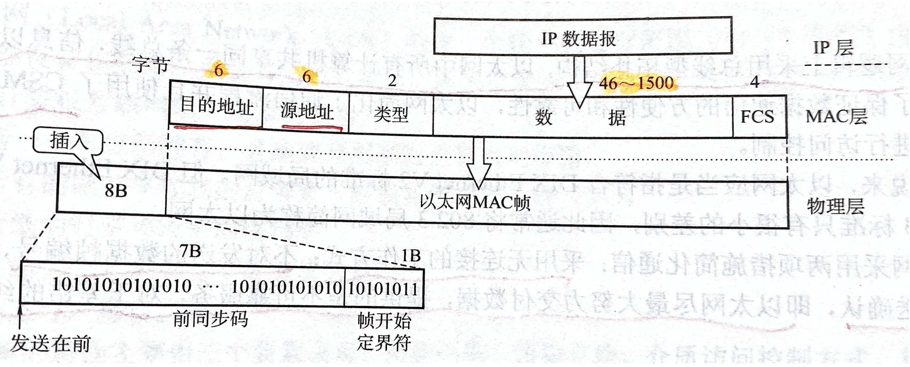
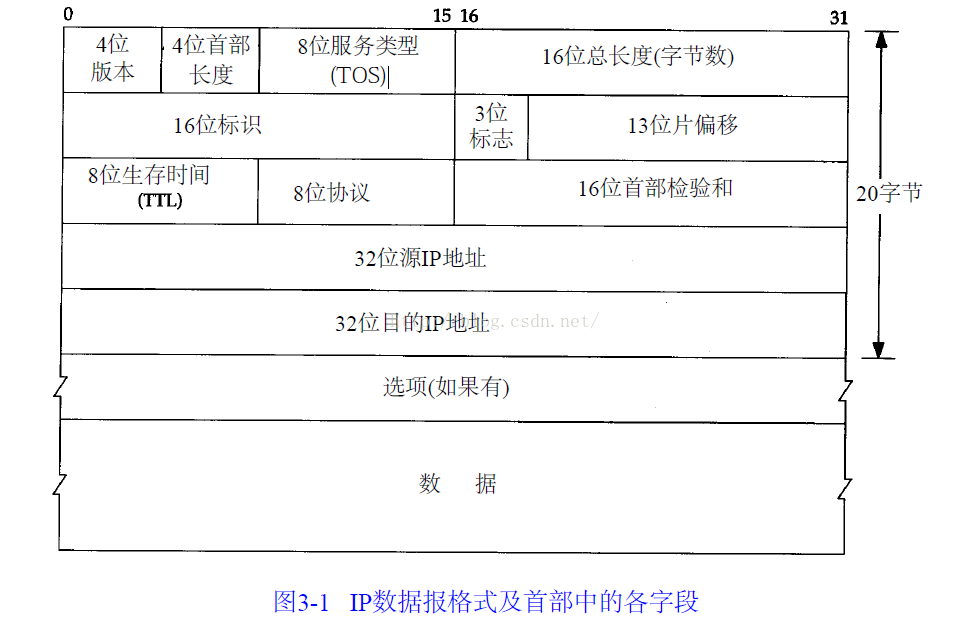
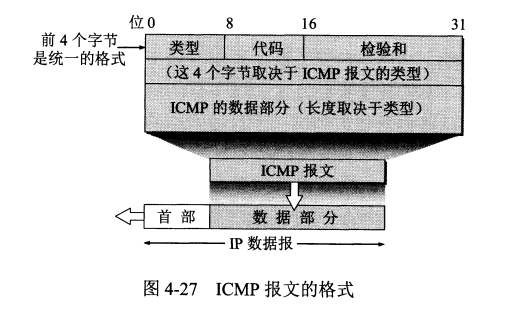

知识点总结框架来自*codesheep*，有删改
# 计算机网络知识点总结

**目录**
- [计算机网络知识点总结](#计算机网络知识点总结)
    - [TCP/IP协议体系的认知](#tcpip协议体系的认知)
    - [物理层（优先度不高，暂略）](#物理层优先度不高暂略)
    - [数据链路层](#数据链路层)
      - [数据链路层的三个基本问题：封装成帧、透明传输和差错检测](#数据链路层的三个基本问题封装成帧透明传输和差错检测)
      - [以太网MAC帧的格式(P96)](#以太网mac帧的格式p96)
      - [ARP协议（P124）](#arp协议p124)
    - [网络层](#网络层)
      - [IP数据报的格式(P128)](#ip数据报的格式p128)
      - [分组转发算法：](#分组转发算法)
      - [网际控制报文协议ICMP（P147）](#网际控制报文协议icmpp147)
    - [传输层（P203）](#传输层p203)
      - [用户数据报协议UDP](#用户数据报协议udp)
      - [传输控制协议TCP](#传输控制协议tcp)
      - [TCP报文段的首部格式](#tcp报文段的首部格式)
      - [TCP可靠传输的实现（P221）](#tcp可靠传输的实现p221)
      - [TCP的流量控制](#tcp的流量控制)
      - [TCP的拥塞控制](#tcp的拥塞控制)
      - [TCP的运输连接管理（P238）](#tcp的运输连接管理p238)
    - [应用层](#应用层)
      - [DNS服务](#dns服务)
      - [HTTP](#http)
### TCP/IP协议体系的认知
分层、透明性、对等

</img>

### 物理层（优先度不高，暂略）

### 数据链路层
#### 数据链路层的三个基本问题：封装成帧、透明传输和差错检测  
   * 封装成帧（P72）  
    所有在互联网上传送的数据都以分组（即IP数据报）为传送单位。网络层的IP数据报传送到数据链路层就成为帧的数据部分。在帧的数据部分的前面和后面分别添加上首部和尾部，构成了一个完整的帧。这样的帧就是数据链路层的数据传送单元。  
    一个帧的帧长等于帧的数据部分的长度加上帧首部和帧尾部的长度。首部和尾部的一个重要作用就是进行**帧定界**（即确定帧的界限）。此外，首部和尾部还包括许多必要的控制信息。在发送帧时，是从帧的首部开始发送的。各种数据链路层协议都对帧首部和帧尾部的格式有明确的规定。显然，为了提高帧的传输效率，应当使帧的数据部分长度尽可能大地大于首部和尾部长度。但是，每一种链路层协议都规定了所能传送的帧的**数据部分长度上限————最大传送单元MTU(Maximum Transfer Unit)**。  
    （图待补充）  
    当传送可打印ASCII字符时，可使用SOH和EOH进行帧定界。  
    * 透明传输  
    使用字节填充/字符填充（在数据部分的SOH或EOH前加上转义字符ESC）保证透明传输  
    * 差错检测  
    使用循环冗余检验CRC（Cyclic Redundancy Check）进行差错检测  

#### 以太网MAC帧的格式(P96)
  

  </img>
  

  前同步码： 调整时钟频率，进行位同步   
  帧开始定界符： 说明帧从下一个字节开始      
  目的地址：mac地址，送到哪里去  
  源地址：mac地址，从哪里来  
  类型：说明上一层使用的是什么协议  
  FCS：帧检验序列  

#### ARP协议（P124）  
  地址解析协议ARP：通过IP地址找到其物理地址  
  逆地址解析协议RARP（已经被DHCP协议取代）  
  每一台计算机都设有一个**ARP高速缓存（ARP Cache）**，里面有**本局域网上**的个主机和各路由器的IP地址到硬件地址的映射表。找不到就广播。  

### 网络层  
#### IP数据报的格式(P128)  

</img>

一个IP数据报由首部和数据两部分组成，首部的前一部分是**固定长度**，共20字节，是所有IP数据报必须具有的。在首部的固定部分的后面是一些**可选字段**，其长度是可变的。

* IP数据报首部的固定部分中的各字段
  1. 版本  
    占4位，指IP协议的版本。目前广泛使用的IP协议版本号为4（即IPv4）
  2. 首部长度  
    占4位，可表示的最大十进制数值为15（这里的15是15个32位字，即60字节，因此首部长度最小为5，最大为15）。  
  3. 区分服务  
    占8位，用来获得更好的服务。  
  4. 总长度  
    总长度字段为8字节，因此数据报的最大长度为2^16-1=65535字节  
    在IP层下面的每一种数据链路层协议都规定了一个数据帧中的数据字段的**最大长度**，这称为最大传送单元MTU（Maximum Transfer Unit）。当一个IP数据报封装成链路层的帧时，此数据包的总长度（即首部加上数据部分）一定不能超过下面的数据链路层所规定的MTU值。例如，最常用的以太网就规定其MTU值是1500字节。若所传送的数据报长度超过数据链路层的MTU值，就必须把过长的数据报进行分片处理。  
    在进行分片时（见后面的“片偏移”字段），数据报首部中的“总长度”字段是指分片后的每一个分片的首部长度与该分片的数据长度的总和。  
  5.标识  
    占16位。IP软件在存储器中维持一个计算器，每产生一个数据报，计数器就加1，并将此值赋给标识字段。**但这个“标识”并不是序号**，因为IP是面向无连接的服务，数据报不存在按序接收的问题。当数据报由于超过网络的MTU而必须分片时，这个标识字段的值都被复制到所有的数据报片的标识字段中。相同的标识字段的值使分片后的各数据报片最后能正确地重装成为原来的数据报。  
  6. 标志  
    占3位，但目前只有两位有意义。  
    * 标志字段的最低位记为**MF(More Fragment)**。MF=1即表示后面“还有分片”的数据报。MF=0表示这已经是若干数据报片中的最后一个。
    * 标志字段的中间一位记为**DF(Don't Fragment)**，意思是“不能分片”。只有当DF=0时才允许分片。
  7. 片偏移  
    占13位，片偏移指出：较长的分组在分片后，某片在原分组中的相对位置。也就是说，相对于用户数据字段的起点，该片从何处开始。片偏移以8个字节为偏移单位。这就是说，除最后一个数据报片外，每个分片的长度一定是8字节的整数倍。
  8. 生存时间  
    占8位，生存时间字段常用的英文缩写是TTL(Time To Live)，表明这是数据报在网络中的**寿命**。由发出数据包的源点设置这个字段。其目的是防止无法交付的数据报无限制地在网络中兜圈子。  
    现在TTL的单位不再是秒，而是跳数。
  9. 协议  
    占8位，协议字段指出此数据报携带的数据是使用何种协议，以便使目的主机的IP层直到应将数据部分上交给哪个协议进行处理。  
  10.  首部检验和  
    占16位。这个字段只检验数据报的首部，但不包括数据部分。  
    这是为了减少计算的工作量，不计算数据部分。为了进一步减小工作量，IP首部的检验不适用复杂的CRC检验码而采用下面的简单计算方法：  
    将检验和字段置零，用反码算术运算把所有16位字相加后，再取反码放入检验和字段。
  11. 源地址
    占32位。
  12. 目的地址  
    占32位。

#### 分组转发算法：
    1. 从数据包的首部提取目的主机的IP地址D，得出目的网络地址N。  
    2. 若N就是与此路由器直接相连的某个网络地址，则进行直接交付，不需要再经过其他的路由器，直接把数据报交付目的主机（这里包括把目的主机地址D转换为具体的硬件地址，把数据报封装为MAC帧，再发送此帧）；否则就是间接交付，执行（3）。  
    3. 若路由表中有目的地址位D的特定主机路由，则把数据报传送给路由表中的所知名的下一跳路由器；否则，执行（4）。  
    4. 若路由表中有到达网络N的路由，则把数据报传送给路由表中所指明的下一跳路由器；否则，执行（5）；  
    5. 若路由表中有一个默认路由，则把数据报传送给路由表中所知名的默认路由器；否则，执行（6）；  
    6. 报告分组转发出错

#### 网际控制报文协议ICMP（P147）  
    为了更有效地转发IP数据报和提高交付成功的机会，在网际层使用了网际控制报文ICMP。  
    ICMP报文装在IP数据报之中。  
    

    </img>
    

    1. ICMP报文的种类：  
    ICMP报文有两种，即ICMP差错报告报文和ICMP询问报文。  
    1. ICMP差错报告报文：  
    常用ICMP差错报告报文有四种：
    * 终点不可达  
    * 时间超过  
    * 参数问题  
    * 改变路由（重定向）  
    1. 常用ICMP询问报文：  
    * 回送请求和回答  
    * 时间戳请求和回答

4. 网络地址转换NAT（P187）

### 传输层（P203）
#### 用户数据报协议UDP
   1. 特点：  
   * 面向无连接  
   * 尽最大努力交付  
   * 面向报文 
   * 无拥塞控制
   * 支持一对一，一对多，多对一，多对多的交互通信
   * 首部开销小，只有8个字节
   2. UDP的首部格式：  
   首部共8字节，4个字段，每个字段2字节。  
   * 源端口  
   * 目的端口 
   * 长度  
   * 校验和  

#### 传输控制协议TCP  
    1. 特点：  
    * 面向连接的运输层协议  
    * 每一条TCP协议只能有两个端点  
    * TCP提供可靠交付的服务  
    * TCP提供全双工通信  
    * 面向字节流  

    2.TCP的连接（P212）  
    TCP的链接有两个端点——被称为套接字（socket）或插口  
    端口号拼接到IP地址，就构成了套接字  
    `套接字 socket=（IP地址：端口号）`  
    每一条TCP链接唯一地被通信两端的两个端点（即两个套接字）所确定  
    TCP连接::={socket1,socket2}={(IP1:port1),(IP2,port2)};

    3. 可靠传输  
    TCP报文段交由IP层传送，但IP层只能提供尽最大努力服务，也就是说，TCP下面的网络提供的是不可靠的传输，因此，TCP必须采用适当的措施才能使得两个运输层之间的通信变得可靠。  
    理想的传输条件有以下两个特点：  
    1）传输信道不产生差错。  
    2）不管发送方以多块的速度发送数据，接收方总是来得及处理收到的数据。  
    * 停止等待协议（自动重传请求ARQ（Automatic Repeat reQuest））——信道利用率太低  
    * 连续ARQ协议（滑动窗口协议）  
    连续ARQ协议规定，发送方每收到一个确认，就把发送窗口向前滑动一个分组的位置。  
    接收方一般都是采用**累积确认**的方式。这就是说，接收方不必对收到的分组逐个发送确认，而是在收到几个分组后，对**按序到达的最后一个分组发送确认**，这就表示：到这个分组为止的所有分组都已经正确收到了。

#### TCP报文段的首部格式  

    

    </img>
    

    1. 源端口和目的端口，各4字节  
    2. 序号，4字节  
    3. 确认号，4字节，为期望收到的对方下一个报文（若确认号为N，则表明到序号N-1的所有数据都已经正确收到）  
    4. 数据偏移：4位，TCP报文段数据起始处距离TCP报文段起始处有多远，实际上**相当于TCP首部长度**
    5. 保留，6位，置零即可  
    6. 紧急URG（URGent），URG=1时说明紧急指针字段有效，发送方会把紧急数据插入到本报文段数据的最前面，要与首部中的紧急指针配合使用
    7. 确认ACK 仅当ACK=1时确认号字段才有效  
    8. 推送PSH  期望对方尽快交付接收应用进程，而不是等到缓存满了再向上交付  
    9. 复位RST  当RST=1时，表明TCP连接中出现严重差错，必须释放连接，然后重新建立运输连接  
    10. 同步SYN SYN=1时说明这是一个连接请求，或一个连接接受报文  
    11. 终止FIN  用来释放一个连接  
    12. 窗口，占2字节  指发送本报文段的一方的接收窗口，即从确认号算起，接收方目前允许对方发送的数据量    
    13. 同UDP，计算时也要加入伪首部  
    14. 紧急指针，占2字节，仅在URG=1时才有意义，它指出本报文段中的紧急数据的字节数（紧急数据结束后就是普通数据）。因此，紧急指针指出了紧急数据的末尾在报文段中的位置。值得注意的是，即使窗口为零时也可以发送紧急数据。
    15. 选项  长度可变，最长40字节，当没有使用“选项”时

#### TCP可靠传输的实现（P221）
    1. 以字节为单位的滑动窗口  
    2. 超时重传时间的选择  
    3. 选择确认SACK（在TCP首部“选项”中使用选择确认）

#### TCP的流量控制  
   发送方的发送窗口不能超过接收方给出的接收窗口的数值。

#### TCP的拥塞控制  
   **慢开始、拥塞避免、快重传、快恢复**  
   1. 慢开始和拥塞避免  
   基于窗口的拥塞控制，发送方维持一个叫做拥塞窗口（congestion window）cwnd的状态变量，让自己的发射窗口等于拥塞窗口  
   慢开始： 从小到大增大拥塞窗口数值（每次翻倍）  
   慢开始门限cwnd=ssthresh后执行拥塞避免算法  
   =>拥塞避免：每RTT让cwnd+1

   2. 快重传  
   一连收到三个重复确认，就立即进行重传  

   3. 快恢复
   快重传时，令ssthresh/=2,cwnd=ssthresh,直接进行拥塞避免

   加法增大AI（Additive Increase），乘法减小MD（Muitiplicative Decrease），AIMD算法

#### TCP的运输连接管理（P238）  
**三个阶段：连接建立，数据传送，连接释放**
  1. 连接建立（三次握手/三报文握手）
  * 最初两端的TCP进程都处于CLOSED状态  
  * B被动打开传输控制块TCB，处于LISTEN状态  
  * A主动打开传输控制快TCB，向B发出连接请求报文段，这时首部中的同步位SYN=1，同时选择一个初始序号seq=x。TCP规定，SYN报文段不能携带数据，但要消耗掉一个序号。这时，TCP客户端进程进入SYN-SENT（同步已发送）状态。
  * B收到连接请求报文段之后，如果同意建立连接，则向A发送确认。在确认报文段将SYN和ACK都置1，确认号ACK=x+1，同时也为自己选择一个初始序号seq=y。依然无数据，消耗序号，B进入SYN-RCVD状态。  
  * TCP客户（A）收到B的确认之后，还要向B给出确认，ACK置1，确认号ACK=y+1，而自己的序号seq=x+1，ACK报文段可以携带数据，但如果不携带数据则不消耗序号，在这种情况下，下一个数据报的报文段序号仍然是seq=x+1，这时，TCP连接已经建立，A进入ESTABLISHED状态。

  2. 连接释放（四次挥手）
   * A：FIN=1，seq=u（前面已经传送过的数据的最后一个字节的序号+1），A进入FIN-WAIT-1状态  
   * B：确认号ACK=u+1，序号v，进入CLOSE-WAIT状态  
   这时的TCP处于**半关闭状态**，即A已经没有要发送的数据了，但如果B发送数据，A仍然要接收  
   * A收到确认后，进入FIN-WAIT-2状态
   (待更新)  

### 应用层
#### DNS服务
#### HTTP
   1. HTTP基本概念
        * HTTP是什么?  
        HTTP是超文本传输协议，也就是HyperText Transfer Protocol。
        * 常见HTTP状态码：
          * 1xx（提示信息，表示目前是协议处理的中间状态，还需要后续的操作）  
          * 2xx（成功，报文已经收到并被正确处理）  
          * 3xx（重定向，资源位置发生变动，需要客户端重新发送请求）  
          * 4xx（客户端错误，请求报文有误，服务器无法处理）  
          * 5xx（服务器错误，服务器在处理请求时内部发生了错误）  
        * HTTP常见字段有哪些？  
        Host字段：客户端发送请求时，用来指定服务器的域名  
        Content-Length字段：服务器在返回数据时，会有Content-Length字段，表明本次回应的数据长度  
        Connection字段  
        Conntection字段最常用于客户端要求服务器使用TCP持久连接，以便其他请求复用。
        HTTP/1.1版本的默认连接都是持久连接，但为了兼容老版本的HTTP，需要指定Connection首部字段的值为Keep-Alive
        Content-Type字段：  
        Content-Type字段用于服务器回应时，告诉客户端，本次数据是什么格式。  
        Content-Encoding字段：  
        说明数据的压缩方法，表示服务器返回的数据使用了什么压缩格式。  
        User-Agent字段：  
        说明客户端使用的是什么浏览器。  
        Accept-Language字段：  
        客户端向服务端说明自己希望使用什么语言。  
   2. GET与POST  
        * GET与POST的区别？  
        Get方法的含义是请求从服务器获取资源，这个资源可以是静态的文本、页面、图片视频等。  
        而POST方法则是向URL指定的资源提交数据，数据放在报文的body里面。  
        * GET和POST方法都是安全和幂等的吗？
        *安全*的概念是：请求方法不会破坏服务器上的资源。  
        *幂等*的概念是：多次执行相同的操作，结果都是相同的。  
        因此，GET方法是安全且幂等的，因为它是只读操作。  
        POST因为是新增或提交数据的操作，会修改服务器上的资源，所以是不安全的，且多次提交数据就会创建多个资源，因此不是幂等的。 
    3. HTTP特性
      * 优点：  
        1. 简单
        2. 灵活和易于扩展
        3. 应用广泛和跨平台
      * 缺点：
        1. 无状态。（服务器不知道用户信息，需要Cookie）
        2. 明文传输  
        3. 不安全——不验证身份信息，不确认报文完整性（或者是否被修改过）
      * HTTP/1.1性能如何？  
        1. 长连接
        2. 管道网络运输
        3. 队头阻塞  
    4. HTTP和HTTPS  
      * HTTP和HTTPS的区别?  
        * HTTP是超文本传输协议，信息是明文传输，存在安全风险的问题。HTTPS则解决HTTP不安全的缺陷，在TCP和HTTP网络层之间加入了SSl/TLS安全协议，使得报文能够加密传输。  
        * HTTP建立连接相对简单，TCP三次握手之后便可进行HTTP的报文传输。而HTTPS在TCP三次握手之后，还需进行SSL/TLS的握手过程，才可进入加密报文传输。  
        * HTTP的端口号是80，HTTPS的端口号是443。  
        * HTTPS协议需要向CA（证书权威机构）申请数字证书，来保证服务器的身份是可信的。
      * HTTPS解决了HTTP的哪些问题？  
        HTTP存在三个风险：窃听风险，篡改风险，冒充风险。  
        HTTPS在HTTP与TCP层之间加入了SSL/TLC协议，可以解决上述风险：信息加密、校验机制、身份证书。  
        *混合加密*的方式实现信息的机密性，解决了窃听的风险。  
        *摘要算法*的方式来实现完整新。  
        将服务器公钥放入到*数字证书*中，解决了冒充的风险。  
        *数字证书*将服务器公钥放在数字证书中，只要证书是可信的，公钥就是可信的。  
      * HTTPS是如何建立连接的？其间交互了什么？  
        SSL/TLS协议基本流程：  
        * 客户端向服务器索要并验证服务器的公钥
        * 双方协商生产会话密钥
        * 双方采用会话密钥进行加密通信  
    5.HTTP/1.1、HTTP/2、HTTP/3的演变
      * HTTP/2相比于HTTP/1.1的改进：
        * 头部压缩
        * 二进制格式
        * 数据流
        * 多路复用
        * 服务器推送
      * HTTP/3相比于HTTP/2的改进：